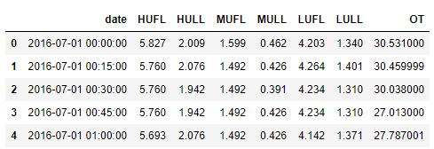
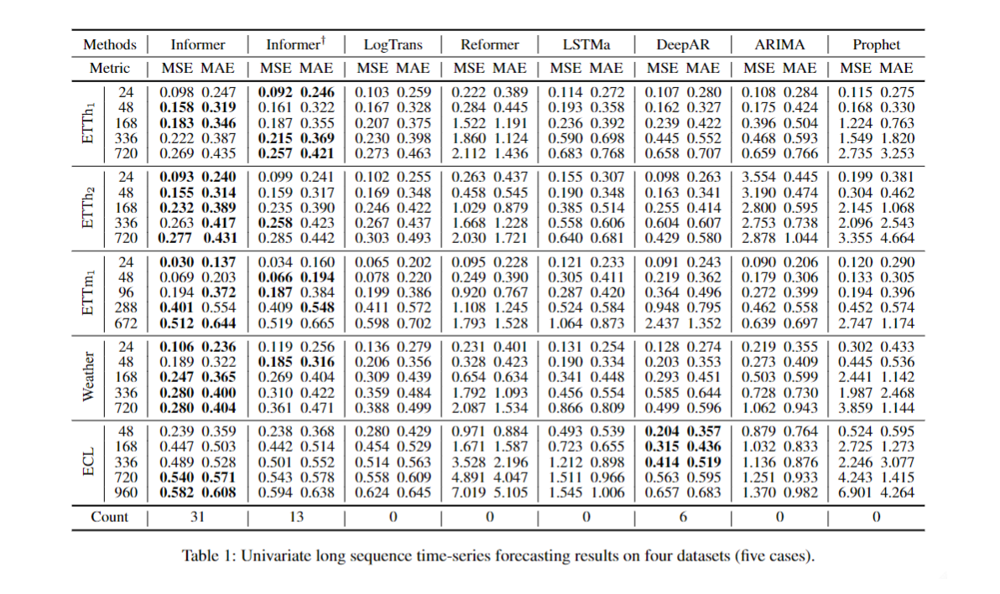
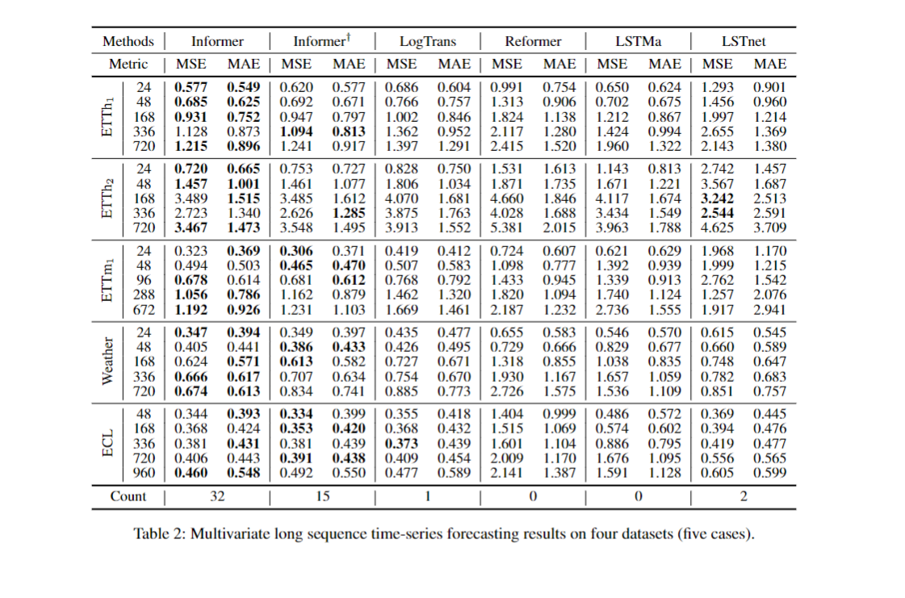

# Informer: Beyond Efficient Transformer for Long Sequence Time-Series Forecasting (AAAI'21 Best Paper)


This is the origin Pytorch implementation of Informer in the following paper: 
[Informer: Beyond Efficient Transformer for Long Sequence Time-Series Forecasting](https://arxiv.org/abs/2012.07436). Special thanks to `Jieqi Peng`@[cookieminions](https://github.com/cookieminions) for building this repo.

:triangular_flag_on_post:**News**(Mar 27, 2023): We will release Informer V2 soon.

:triangular_flag_on_post:**News**(Feb 28, 2023): The Informer's [extension paper](https://www.sciencedirect.com/science/article/pii/S0004370223000322) is online on AIJ.

:triangular_flag_on_post:**News**(Mar 25, 2021): We update all experiment [results](#resultslink) with hyperparameter settings.

:triangular_flag_on_post:**News**(Feb 22, 2021): We provide [Colab Examples](#colablink) for friendly usage.

:triangular_flag_on_post:**News**(Feb 8, 2021): Our Informer paper has been awarded [AAAI'21 Best Paper \[Official\]](https://aaai.org/Conferences/AAAI-21/aaai-outstanding-and-distinguished-papers/)[\[Beihang\]](http://scse.buaa.edu.cn/info/1097/7443.htm)[\[Rutgers\]](https://www.business.rutgers.edu/news/hui-xiong-and-research-colleagues-receive-aaai-best-paper-award)! We will continue this line of research and update on this repo. Please star this repo and [cite](#citelink) our paper if you find our work is helpful for you.

<p align="center">

<br><br>
<b>Figure 1.</b> The architecture of Informer.
</p>

## ProbSparse Attention
The self-attention scores form a long-tail distribution, where the "active" queries lie in the "head" scores and "lazy" queries lie in the "tail" area. We designed the ProbSparse Attention to select the "active" queries rather than the "lazy" queries. The ProbSparse Attention with Top-u queries forms a sparse Transformer by the probability distribution.
`Why not use Top-u keys?` The self-attention layer's output is the re-represent of input. It is formulated as a weighted combination of values w.r.t. the score of dot-product pairs. The top queries with full keys encourage a complete re-represent of leading components in the input, and it is equivalent to selecting the "head" scores among all the dot-product pairs. If we choose Top-u keys, the full keys just preserve the trivial sum of values within the "long tail" scores but wreck the leading components' re-represent.
<p align="center">

<br><br>
<b>Figure 2.</b> The illustration of ProbSparse Attention.
</p>

## Requirements

- Python 3.6
- matplotlib == 3.1.1
- numpy == 1.19.4
- pandas == 0.25.1
- scikit_learn == 0.21.3
- torch == 1.8.0

Dependencies can be installed using the following command:
```bash
pip install -r requirements.txt
```

## Data

The ETT dataset used in the paper can be downloaded in the repo [ETDataset](https://github.com/zhouhaoyi/ETDataset).
The required data files should be put into `data/ETT/` folder. A demo slice of the ETT data is illustrated in the following figure. Note that the input of each dataset is zero-mean normalized in this implementation.

<p align="center">

<br><br>
<b>Figure 3.</b> An example of the ETT data.
</p>

The ECL data and Weather data can be downloaded here.
- [Google Drive](https://drive.google.com/drive/folders/1ohGYWWohJlOlb2gsGTeEq3Wii2egnEPR?usp=sharing)
- [BaiduPan](https://pan.baidu.com/s/1wyaGUisUICYHnfkZzWCwyA), password: 6gan 

## Reproducibility

To easily reproduce the results you can follow the next steps:
1. Initialize the docker image using: `make init`.
2. Download the datasets using: `make dataset`.
3. Run each script in `scripts/` using `make run_module module="bash ETTh1.sh"` for each script.
4. Alternatively, run all the scripts at once:
```
for file in `ls scripts`; do make run_module module="bash scripts/$script"; done
```

## Usage
<span id="colablink">Colab Examples:</span> We provide google colabs to help reproduce and customize our repo, which includes `experiments(train and test)`, `prediction`, `visualization` and `custom data`.
[](https://colab.research.google.com/drive/1_X7O2BkFLvqyCdZzDZvV2MB0aAvYALLC)

Commands for training and testing the model with *ProbSparse* self-attention on Dataset ETTh1, ETTh2 and ETTm1 respectively:

```bash
# ETTh1
python -u main_informer.py --model informer --data ETTh1 --attn prob --freq h

# ETTh2
python -u main_informer.py --model informer --data ETTh2 --attn prob --freq h

# ETTm1
python -u main_informer.py --model informer --data ETTm1 --attn prob --freq t
```

More parameter information please refer to `main_informer.py`.

We provide a more detailed and complete command description for training and testing the model:

```python
python -u main_informer.py --model <model> --data <data>
--root_path <root_path> --data_path <data_path> --features <features>
--target <target> --freq <freq> --checkpoints <checkpoints>
--seq_len <seq_len> --label_len <label_len> --pred_len <pred_len>
--enc_in <enc_in> --dec_in <dec_in> --c_out <c_out> --d_model <d_model>
--n_heads <n_heads> --e_layers <e_layers> --d_layers <d_layers>
--s_layers <s_layers> --d_ff <d_ff> --factor <factor> --padding <padding>
--distil --dropout <dropout> --attn <attn> --embed <embed> --activation <activation>
--output_attention --do_predict --mix --cols <cols> --itr <itr>
--num_workers <num_workers> --train_epochs <train_epochs>
--batch_size <batch_size> --patience <patience> --des <des>
--learning_rate <learning_rate> --loss <loss> --lradj <lradj>
--use_amp --inverse --use_gpu <use_gpu> --gpu <gpu> --use_multi_gpu --devices <devices>
```

The detailed descriptions about the arguments are as following:

| Parameter name | Description of parameter |
| --- | --- |
| model | The model of experiment. This can be set to `informer`, `informerstack`, `informerlight(TBD)` |
| data           | The dataset name                                             |
| root_path      | The root path of the data file (defaults to `./data/ETT/`)    |
| data_path      | The data file name (defaults to `ETTh1.csv`)                  |
| features       | The forecasting task (defaults to `M`). This can be set to `M`,`S`,`MS` (M : multivariate predict multivariate, S : univariate predict univariate, MS : multivariate predict univariate) |
| target         | Target feature in S or MS task (defaults to `OT`)             |
| freq           | Freq for time features encoding (defaults to `h`). This can be set to `s`,`t`,`h`,`d`,`b`,`w`,`m` (s:secondly, t:minutely, h:hourly, d:daily, b:business days, w:weekly, m:monthly).You can also use more detailed freq like 15min or 3h |
| checkpoints    | Location of model checkpoints (defaults to `./checkpoints/`)  |
| seq_len | Input sequence length of Informer encoder (defaults to 96) |
| label_len | Start token length of Informer decoder (defaults to 48) |
| pred_len | Prediction sequence length (defaults to 24) |
| enc_in | Encoder input size (defaults to 7) |
| dec_in | Decoder input size (defaults to 7) |
| c_out | Output size (defaults to 7) |
| d_model | Dimension of model (defaults to 512) |
| n_heads | Num of heads (defaults to 8) |
| e_layers | Num of encoder layers (defaults to 2) |
| d_layers | Num of decoder layers (defaults to 1) |
| s_layers | Num of stack encoder layers (defaults to `3,2,1`) |
| d_ff | Dimension of fcn (defaults to 2048) |
| factor | Probsparse attn factor (defaults to 5) |
| padding | Padding type(defaults to 0). |
| distil | Whether to use distilling in encoder, using this argument means not using distilling (defaults to `True`) |
| dropout | The probability of dropout (defaults to 0.05) |
| attn | Attention used in encoder (defaults to `prob`). This can be set to `prob` (informer), `full` (transformer) |
| embed | Time features encoding (defaults to `timeF`). This can be set to `timeF`, `fixed`, `learned` |
| activation | Activation function (defaults to `gelu`) |
| output_attention | Whether to output attention in encoder, using this argument means outputing attention (defaults to `False`) |
| do_predict | Whether to predict unseen future data, using this argument means making predictions (defaults to `False`) |
| mix | Whether to use mix attention in generative decoder, using this argument means not using mix attention (defaults to `True`) |
| cols | Certain cols from the data files as the input features |
| num_workers | The num_works of Data loader (defaults to 0) |
| itr | Experiments times (defaults to 2) |
| train_epochs | Train epochs (defaults to 6) |
| batch_size | The batch size of training input data (defaults to 32) |
| patience | Early stopping patience (defaults to 3) |
| learning_rate | Optimizer learning rate (defaults to 0.0001) |
| des | Experiment description (defaults to `test`) |
| loss | Loss function (defaults to `mse`) |
| lradj | Ways to adjust the learning rate (defaults to `type1`) |
| use_amp | Whether to use automatic mixed precision training, using this argument means using amp (defaults to `False`) |
| inverse | Whether to inverse output data, using this argument means inversing output data (defaults to `False`) |
| use_gpu | Whether to use gpu (defaults to `True`) |
| gpu | The gpu no, used for training and inference (defaults to 0) |
| use_multi_gpu | Whether to use multiple gpus, using this argument means using mulitple gpus (defaults to `False`) |
| devices | Device ids of multile gpus (defaults to `0,1,2,3`) |


## <span id="resultslink">Results</span>

We have updated the experiment results of all methods due to the change in data scaling. We are lucky that Informer gets performance improvement. Thank you @lk1983823 for reminding the data scaling in [issue 41](https://github.com/zhouhaoyi/Informer2020/issues/41).

Besides, the experiment parameters of each data set are formated in the `.sh` files in the directory `./scripts/`. You can refer to these parameters for experiments, and you can also adjust the parameters to obtain better mse and mae results or draw better prediction figures.

<p align="center">

<br><br>
<b>Figure 4.</b> Univariate forecasting results.
</p>

<p align="center">

<br><br>
<b>Figure 5.</b> Multivariate forecasting results.
</p>


## FAQ
If you run into a problem like `RuntimeError: The size of tensor a (98) must match the size of tensor b (96) at non-singleton dimension 1`, you can check torch version or modify code about `Conv1d` of `TokenEmbedding` in `models/embed.py` as the way of circular padding mode in Conv1d changed in different torch versions.


## <span id="citelink">Citation</span>
If you find this repository useful in your research, please consider citing the following papers:

```
@article{haoyietal-informerEx-2023,
  author    = {Haoyi Zhou and
               Jianxin Li and
               Shanghang Zhang and
               Shuai Zhang and
               Mengyi Yan and
               Hui Xiong},
  title     = {Expanding the prediction capacity in long sequence time-series forecasting},
  journal   = {Artificial Intelligence},
  volume    = {318},
  pages     = {103886},
  issn      = {0004-3702},
  year      = {2023},
}
```
```
@inproceedings{haoyietal-informer-2021,
  author    = {Haoyi Zhou and
               Shanghang Zhang and
               Jieqi Peng and
               Shuai Zhang and
               Jianxin Li and
               Hui Xiong and
               Wancai Zhang},
  title     = {Informer: Beyond Efficient Transformer for Long Sequence Time-Series Forecasting},
  booktitle = {The Thirty-Fifth {AAAI} Conference on Artificial Intelligence, {AAAI} 2021, Virtual Conference},
  volume    = {35},
  number    = {12},
  pages     = {11106--11115},
  publisher = {{AAAI} Press},
  year      = {2021},
}
```

## Contact
If you have any questions, feel free to contact Haoyi Zhou through Email (zhouhaoyi1991@gmail.com) or Github issues. Pull requests are highly welcomed!

## Acknowledgments
Thanks for the computing infrastructure provided by Beijing Advanced Innovation Center for Big Data and Brain Computing ([BDBC](http://bdbc.buaa.edu.cn/)).
At the same time, thank you all for your attention to this work! [](http://hits.actsmart.cn/)
[](https://github.com/zhouhaoyi/Informer2020/stargazers)
